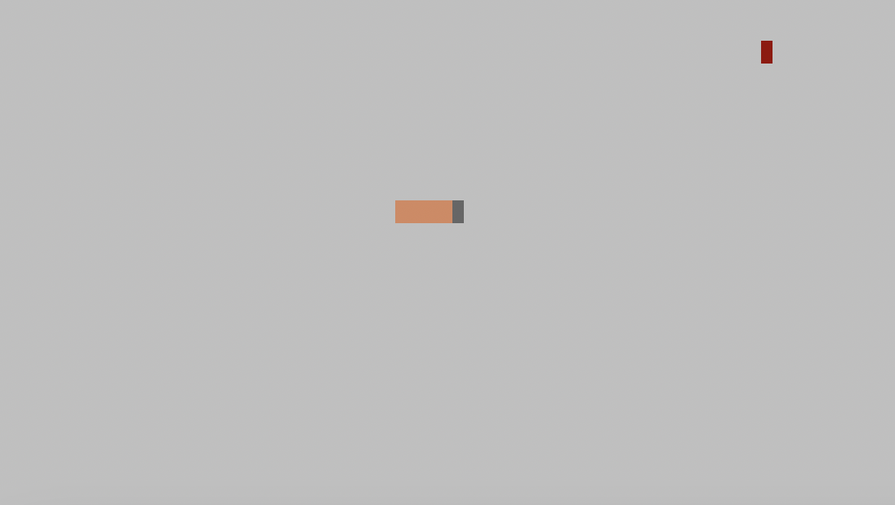
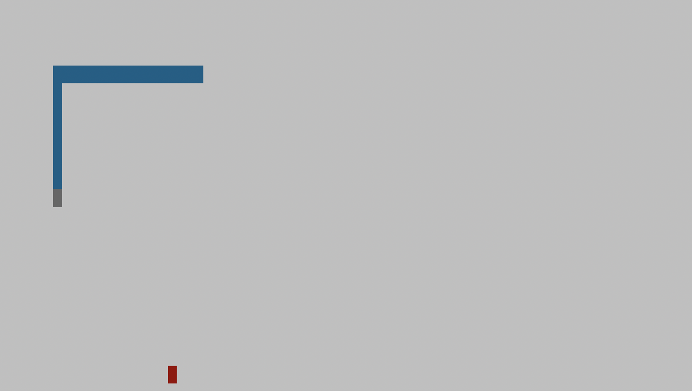

# Snake Client Project

Snake game is a very popular video game. It is a video game concept where the player maneuvers a dot and grows it by ‘eating’ pieces of food. As it moves and eats, it grows and the growing snake becomes an obstacle to smooth maneuvers. The goal is to grow it to become as big as possible without bumping into the side walls, or bumping into itself, upon which it dies.

This is simply a multiplayer take on the genre.

Before you can run this client, you will need to be running the server side which you can download and install from here. 

## Final Product

### When You First Connect To The Server

### As You Collect Red Squares You Slowly Get Bigger

## Getting Started

- Follow steps inside the snek server repo to run the server side
- Start by running the server using `npm run play`
- Run the development snake client using the `node play.js` command.

## Gameplay
Move the snake using the following keys:
- w: Moves the snake up
- s: Moves the snake down
- d: Moves the snake right
- a: Moves the snake left

Print fun messages using the following keys:
- q, e, x, f 
- I won't ruin the surprise press them in game!